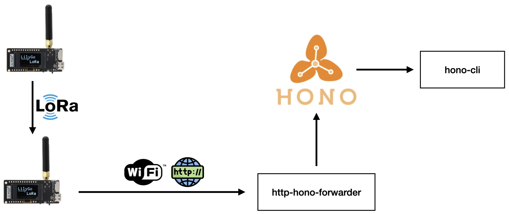

# LoRa ESP32 Hono

This example allows you to send packets using [LoRa](https://lora-alliance.org) from an ESP32 to another one.
The receiver ESP32 will forward the received packets to an [Eclipse Hono](https://www.eclipse.org/hono/) instance, running on a Kubernetes cluster, through a WiFi connection.

## Requirements

- 2 ESP32 boards with a LoRa module
- Eclipse Hono instance

### Boards

This tutorial uses the [LilyGo T3-S3](https://www.lilygo.cc/products/t3s3-v1-0) board, a custom ESP32 board with a LoRa module and an OLED display.

## Tutorial

### Boards setup

1. Clone this repository
2. run `build-env.sh` script to download dependencies
3. Open [Arduino IDE](https://www.arduino.cc)
4. Install the [ESP32 board support](https://docs.espressif.com/projects/arduino-esp32/en/latest/installing.html)
5. Adjust configuration of WiFi and Hono credentials in `LoRaReceiver/WiFiHonoClient.h`
6. Flash the firmware to the ESP32 boards
    - `LoRaSender` to the sender board
    - `LoRaReceiver` to the receiver board

#### Troubleshooting board flashing

If you have trouble on flashing the firmware to the boards, try to flash the board default firmware.
Here a [guide](https://pmanzoni.notion.site/How-to-LoRaWAN-con-ESP32-en-Arduino-IDE-1510f7470c044755b8094cd7e159583a) that can help you.

### Hono setup

1. Deploy an Eclipse Hono instance. You can use the script from this repository to deploy it on a Kubernetes cluster, based on **Minikube**, `hono/deploy-hono.sh`.
2. Provision a device in Hono. You can use the script from this repository to provision a device in Hono, `hono/playground/device-provisioning.sh`.

#### Http Hono Forwarder

Given the fact that Hono is deployed using a Kubernetes cluster, based on Minikube, it's not straightforward to access the Hono instance from outside the machine where it's running.

For this purpose, it's been implemented `http-hono-forwarder`, a simple HTTP server that listen to requests like *Hono HTTP Adapter*, and forwards them to the Hono instance.

> **Note**: from a client perspective, it's like sending requests directly to the Hono instance.

You can run it as follows:

- Using Node.js
```bash
http-hono-forwarder> npm install
http-hono-forwarder> node index.js
```
- Using Docker
```bash
http-hono-forwarder> docker build -t http-hono-forwarder .
http-hono-forwarder> docker run -p 3000:3000 http-hono-forwarder
```

### The overall architecture

- `Sender ESP32` sends packets using LoRa
- `Receiver ESP32` receives packets using LoRa and forwards them using WiFi to the `http-hono-forwarder`
- `http-hono-forwarder` forwards the packets to the `Hono instance`
- `Hono instance` receives the packets and forwards them to upstream APIs
- `Hono-CLI` is used to get the messages from the Hono instance


